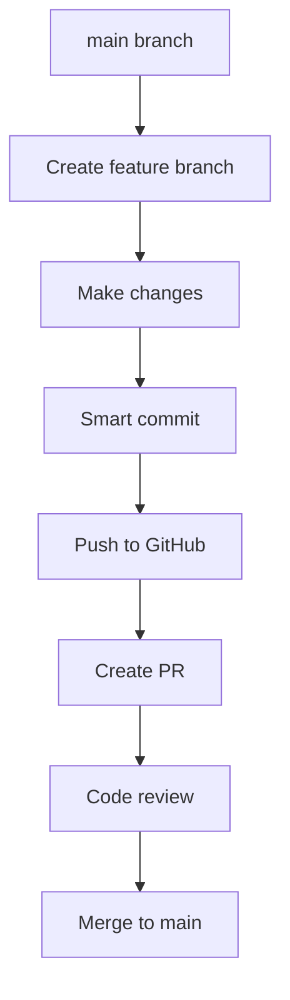

# Development Workflow Guide

## 🎯 Overview

This project uses a feature-branch workflow with automated quality checks and manual control over deployments. All hooks are designed to catch issues early while giving you full control over when to commit and deploy.

## 🔧 Available Development Commands

### Quick Commands (Recommended)
```bash
# Start new feature
bash .claude/hooks/create-feature-branch.sh "pdf-merger"
bash .claude/hooks/create-feature-branch.sh "auth-bug" fix

# Smart commit (runs all checks)
bash .claude/hooks/smart-commit.sh "feat: add PDF merger functionality"

# Manual git operations (when you want full control)
git add .
git commit -m "your message"  # (triggers pre-commit hooks)
git push -u origin feature/your-feature
```

### Slash Commands (To Be Added)
```bash
/new-feature <name>     # Create feature branch
/commit <message>       # Smart commit
/pr                     # Create pull request
/deploy                 # Deploy to production
```

## 🌊 Git Workflow

### 1. Feature Development


### 2. Branch Naming Convention
```
feature/pdf-processing    # New features
fix/memory-leak          # Bug fixes  
feat/ui-improvements     # Feature enhancements
docs/api-documentation   # Documentation
refactor/error-handling  # Code refactoring
test/background-removal  # Tests
chore/dependency-update  # Maintenance
```

### 3. Commit Message Format
```
<type>(<scope>): <description>

<body>

<footer>
```

**Types:** `feat`, `fix`, `docs`, `style`, `refactor`, `test`, `chore`

**Examples:**
```
feat(pdf): add batch merge functionality
fix(ui): resolve memory leak in image processing
docs(api): update background removal endpoints
```

## 🛡️ Automated Quality Checks

### Pre-Commit Hooks (Automatic)
- ✅ **Code Formatting** - Prettier/ESLint for JS/TS
- ✅ **Type Checking** - TypeScript validation
- ✅ **Linting** - Code quality checks
- ✅ **Tests** - Run relevant tests
- ✅ **Dependency Check** - Validate package.json changes
- ✅ **Branch Protection** - Prevent direct commits to main
- ✅ **File Size Check** - Prevent large files
- ✅ **Sensitive Data** - Check for secrets/keys

### Pre-Push Hooks (Automatic)
- ✅ **Full Test Suite** - All tests must pass
- ✅ **Build Validation** - Ensure project builds
- ✅ **PR Suggestions** - Remind to create PRs

## 📋 Development Checklist

### Starting New Feature
- [ ] Pull latest main: `git checkout main && git pull origin main`
- [ ] Create feature branch: `bash .claude/hooks/create-feature-branch.sh "feature-name"`
- [ ] Make your changes
- [ ] Write tests for new functionality

### Before Committing
- [ ] Run tests locally: `npm test`
- [ ] Check TypeScript: `npm run typecheck`
- [ ] Review changes: `git diff`
- [ ] Use smart commit: `bash .claude/hooks/smart-commit.sh "your message"`

### Before Creating PR
- [ ] Push branch: `git push -u origin feature/your-feature`
- [ ] Ensure CI passes
- [ ] Write descriptive PR title and description
- [ ] Create PR: `gh pr create --title "Title" --body "Description"`

## 🚀 Deployment Strategy

### Development Flow
1. **Feature branches** - All development work
2. **Main branch** - Stable, tested code
3. **Production releases** - Tagged releases from main

### Deployment Commands
```bash
# Create release (manual)
git checkout main
git pull origin main
git tag -a v1.0.0 -m "Release v1.0.0"
git push origin v1.0.0

# Or use GitHub releases
gh release create v1.0.0 --title "v1.0.0" --notes "Release notes"
```

## 🔍 Troubleshooting

### Blocked Commits
```bash
# If pre-commit hooks fail:
npm run lint:fix          # Fix formatting issues
npm run typecheck         # Check TypeScript errors
npm test                  # Run tests and fix failures

# If branch protection blocks you:
git checkout -b feature/your-fix
# Make changes and commit from feature branch
```

### Hook Failures
```bash
# Check hook logs
cat .claude/logs/hooks.log

# Run hooks manually for debugging
bash .claude/hooks/pre-commit-check.sh
bash .claude/hooks/git-workflow.sh
```

### Emergency Bypasses (Use Sparingly)
```bash
# Skip pre-commit hooks (NOT recommended)
git commit -m "message" --no-verify

# Force push (dangerous - avoid on shared branches)
git push --force-with-lease
```

## 📊 Monitoring & Logging

### Session Logs
- **Activity Log:** `.claude/logs/activity.log` - User actions
- **Hook Log:** `.claude/logs/hooks.log` - Hook execution
- **Daily Stats:** `.claude/logs/stats-YYYY-MM-DD.json` - Session metrics

### Branch Documentation
Each feature branch creates documentation at:
```
.claude/logs/branch-{feature-name}.md
```

## ⚙️ Configuration Files

### Hook Settings
- **`.claude/settings.json`** - Main hook configuration
- **`.claude/settings.local.json`** - Local overrides
- **`.claude/hooks/`** - Hook scripts directory

### Project Configuration  
- **`CLAUDE.md`** - Project development guidelines
- **`package.json`** - Frontend dependencies and scripts
- **`src-tauri/Cargo.toml`** - Rust/Tauri configuration

## 🎯 Best Practices

### Code Quality
1. **Write tests first** (TDD approach)
2. **Keep functions small** (<50 lines)
3. **Use descriptive names** for variables and functions
4. **Comment complex logic** but not obvious code
5. **Handle errors gracefully** with proper error types

### Git Practices
1. **Small, focused commits** - One logical change per commit
2. **Descriptive commit messages** - Explain why, not just what
3. **Regular pushes** - Don't hoard changes locally
4. **Clean history** - Use interactive rebase when needed
5. **Review before merging** - Never merge without review

### Development Flow
1. **Plan before coding** - Understand requirements fully
2. **Test early and often** - Don't wait until the end
3. **Document as you go** - Update docs with changes
4. **Monitor performance** - Check memory and CPU usage
5. **Security first** - Never commit secrets or keys

## 📞 Getting Help

### Common Commands Reference
```bash
# Project setup
npm install                    # Install dependencies
npm run dev                    # Start development server
cargo tauri dev               # Start Tauri app

# Quality checks
npm run lint                  # Check code style
npm run typecheck            # Check TypeScript
npm test                     # Run tests
cargo clippy                 # Check Rust code

# Git workflow
git status                   # Check current state
git log --oneline           # View commit history
gh pr list                  # List pull requests
gh pr status                # Check PR status
```

### Hook Commands
```bash
# Manual hook execution
bash .claude/hooks/create-feature-branch.sh "feature-name"
bash .claude/hooks/smart-commit.sh "commit message"
bash .claude/hooks/pre-commit-check.sh
bash .claude/hooks/git-workflow.sh
```

---

**Last Updated:** $(date '+%Y-%m-%d')
**Version:** 1.0
**Maintained by:** Claude Code Development Assistant